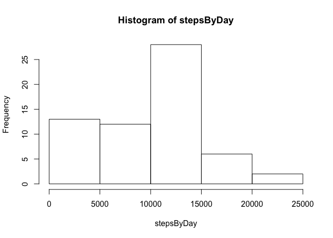
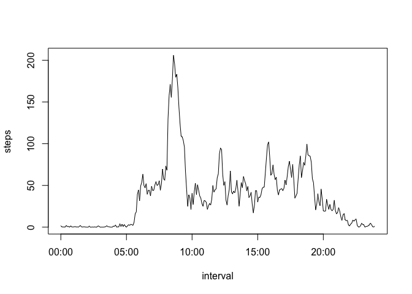
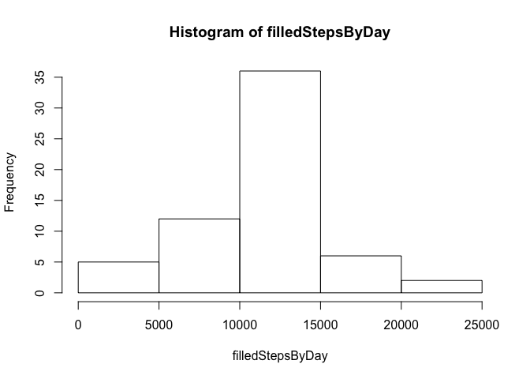
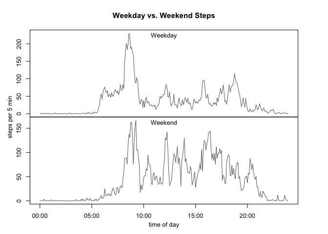

# Reproducible Research: Peer Assessment 1


## Loading and preprocessing the data

```r
#1.1
data <- read.csv('activity.csv')

#1.2
stepsByInterval <- sapply(split(data$steps, data$interval), mean, na.rm=TRUE)
interval <- seq(as.POSIXlt(data$date[1]), by= '5 min', length.out=288)
```

## What is mean total number of steps taken per day?

```r
#2.1
stepsByDay <- tapply(data$steps, data$date, sum, na.rm=TRUE)

#2.2
hist(stepsByDay)
```

 

```r
#2.3
mean(stepsByDay)
```

```
Q2 [1] 9354.23
```

```r
median(stepsByDay)
```

```
Q2 [1] 10395
```

## What is the average daily activity pattern?

```r
#3.1
plot(interval, stepsByInterval, type='l', ylab='steps')
```

 

```r
#3.2
names(which.max(stepsByInterval))
```

```
Q3 [1] "835"
```

## Imputing missing values

```r
#4.1
sum(is.na(data$steps))
```

```
Q4 [1] 2304
```

```r
#4.2
```
I am going to fill in the missing values by replacing `NA` values with the mean steps for that specific interval as calculated in 1.2 above.


```r
#4.3
filledData <- data
for(i in 1:nrow(filledData)){
    if(is.na(filledData[i, 1])){
        filledData[i, 1] <- stepsByInterval[[as.character(filledData[i,3])]]
    }
}

#4.4
filledStepsByDay <- tapply(filledData$steps, filledData$date, sum)
hist(filledStepsByDay)
```

 

```r
mean(filledStepsByDay)
```

```
Q4 [1] 10766.19
```

```r
median(filledStepsByDay)
```

```
Q4 [1] 10766.19
```
Yes, the mean and median differ from 2.3. Both mean and median with imputed values are higher, especially mean. Imputing the missing values made the distribution more akin to a normal distribution (now median equals mean), moving a lot of days from the left tail to the center of the histogram.

## Are there differences in activity patterns between weekdays and weekends?

```r
#5.1
for(i in 1:nrow(filledData)){
    day <- weekdays(as.POSIXlt(filledData[i,2]))
    if(substr(day,1,1)=='S'){
        filledData$weekday[i] <- 'weekend'
    } else {
        filledData$weekday[i] <- 'weekday'
    }
}
filledData$weekday <- factor(filledData$weekday)

#5.2
iwSteps <- tapply(filledData$steps, list(filledData$interval, filledData$weekday), mean)
par(mar=c(0,0,0,0), oma=c(4,4,4,4), mfrow=c(2,1), cex=0.8)
plot(interval, iwSteps[,1], type='l', col='grey40', xaxt='n')
mtext('Weekday', side=3, line=-1.2, cex=0.8)
plot(interval, iwSteps[,2], type='l', col='grey40', xaxt='s')
mtext('Weekend', side=3, line=-1.2, cex=0.8)
title(main='Weekday vs. Weekend Steps', outer=TRUE)
mtext(c('time of day', 'steps per 5 min'), side=c(1,2), 
      outer=TRUE, line=2.2, cex=0.8)
```

 
